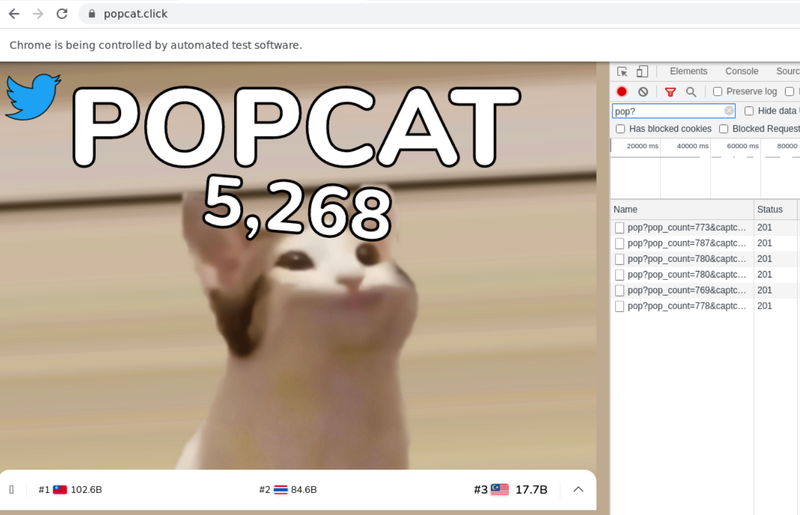

# Popcat Clicker Bot
Click the cat




## Dependencies
- Linux OS
- Google Chrome
- NodeJS 14.x

## Setup
- Install node dependencies
```
npm install
```
- Install google chrome
    - Currently needs to be in `/opt/google/chrome/google-chrome`

## Run
```
npm start
```

## Stop
- Close the browser